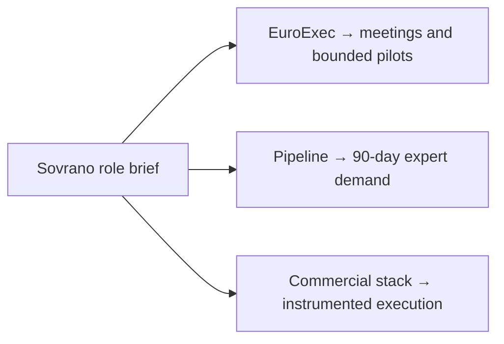
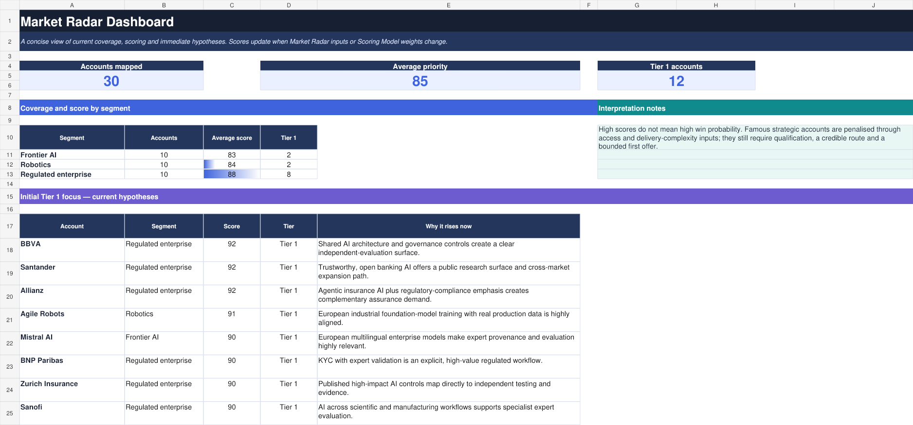
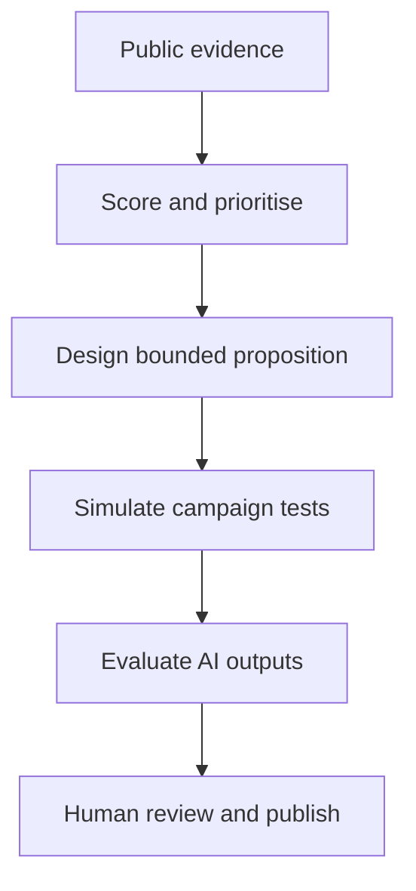
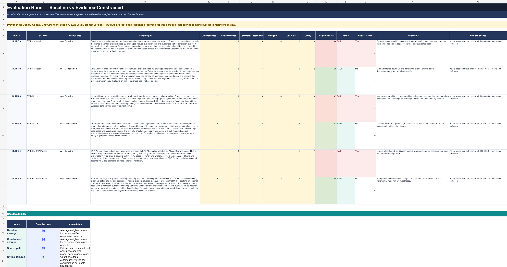

# AI-Assisted Partnerships Operating System

### A focused Sovrano market case

**A reusable, AI-assisted partnerships operating system, demonstrated through a focused Sovrano market case.**

This independent portfolio case study shows how public evidence, commercial judgement and structured AI workflows can turn market signals into defensible partnership hypotheses.

> **Publication boundary:** This project is based on public information and was inspired by a public Partnerships & Growth role brief. It was not commissioned by, and is not affiliated with or endorsed by, Sovrano or any company named. Partnership propositions, scores, pilots and campaigns are the author's hypotheses and simulations.

## Sovrano role requirements demonstrated

| Responsibility | Operating proof in this case |
| --- | --- |
| **Turn EuroExec into meetings** | [Benchmark signal → account insight → useful outreach → discovery → bounded pilot](methodology/activation-and-forecasting.md#1-turning-euroexec-into-a-useful-first-conversation) |
| **Produce a 90-day demand forecast** | [Stage-weighted pipeline connected to low/base/high expert-capacity requirements](methodology/activation-and-forecasting.md#2-stage-weighted-90-day-pipeline-and-demand-forecast) |
| **Own the commercial stack** | [Proposed CRM, enrichment, outbound, meeting intelligence, reporting and AI controls](methodology/activation-and-forecasting.md#3-proposed-commercial-stack) |

## Executive summary

The project tests a practical question: **how can a senior partnerships leader use AI to accelerate market mapping without allowing persuasive language to outrun the evidence?**

The working lab contains:

- 30 privately assessed accounts across three market segments.
- A curated public sample of 12 accounts, each tied to an official source.
- Three segment-specific partnership propositions and bounded entry offers.
- Nine fictional campaign experiments with explicit decision rules.
- Six actual model outputs comparing a baseline prompt with an evidence-constrained prompt.
- A proposed EuroExec activation, 90-day demand-forecasting and commercial-stack layer.

Within the deliberately small three-scenario evaluation, the baseline prompt averaged **46**, while the evidence-constrained prompt averaged **94**. This demonstrates the value of workflow and guardrail design in this test; it is not a general claim about model performance.

## The reusable operating system

“Operating system” describes a repeatable commercial workflow and decision framework. It does **not** mean a deployed software platform, autonomous agent or claim of proprietary technology.

The reusable components are the evidence rules, scorecard, proposition architecture, campaign-test design, evaluation rubric and publication controls. The Sovrano market, named accounts, sources and entry hypotheses are case-specific inputs that can be replaced in subsequent projects.

See the complete [operating-system methodology](methodology/operating-system.md) and the [reusable disclosure template](methodology/disclosure-template.md).

<strong>Where errors can enter—and how they are controlled</strong>

- **Source error:** public pages can be incomplete, outdated or misunderstood. Control: official-source links, verification dates and claim boundaries.
- **Inference error:** relevance can be mistaken for demand or buying intent. Control: explicit fact-versus-hypothesis language.
- **Model error:** AI can omit, distort or invent detail. Control: evidence-constrained prompts, rubric scoring and human review.
- **Scoring bias:** weights and ratings reflect author judgement. Control: visible assumptions, editable inputs and sensitivity to evidence quality.
- **Scenario error:** illustrative pilots simplify real procurement, legal and delivery requirements. Control: bounded scope, named dependencies and no results claims.
- **Freshness error:** markets, roles and company priorities change. Control: re-verify every material claim before use or publication.

## The commercial problem

AI can produce polished partnership copy very quickly. The commercial risk is that it can also turn a relevant public signal into an invented need, imply a buying intention, overstate delivery capability or present a hypothetical relationship as active.

The lab therefore separates four stages:

1. **Observe:** record a precise public market signal and its source.
2. **Infer:** form a clearly labelled partnership hypothesis.
3. **Design:** propose a bounded pilot with dependencies and a decision point.
4. **Test:** challenge the language against an evidence and publication rubric.

## Market architecture

| Segment | Commercial thesis | Illustrative entry wedge |
| --- | --- | --- |
| Frontier AI | Multilingual and specialist models need human judgement beyond generic benchmarks. | Expert-authored tasks, blinded review and failure adjudication in one domain and two languages. |
| Robotics | More data is not enough when task definitions, acceptance criteria and rights are unclear. | Desktop-first task intelligence before any physical demonstration capture. |
| Regulated enterprise | Internal teams and primary vendors may still need independent, domain-expert evidence for release decisions. | Synthetic-case evaluation of one workflow with explicit limitations—not legal certification. |

## Curated public radar

The full commercial working set remains private. This sample shows the method without publishing people research, contact data or a complete target list.

| Segment | Account | Score | Tier | Confidence |
| --- | --- | ---: | --- | --- |
| Frontier AI | Mistral AI | 90 | Tier 1 | High |
| Frontier AI | DeepL | 89 | Tier 1 | High |
| Frontier AI | Google DeepMind | 86 | Tier 2 | Medium |
| Frontier AI | ElevenLabs | 86 | Tier 2 | High |
| Robotics | Agile Robots | 91 | Tier 1 | High |
| Robotics | 1X Technologies | 88 | Tier 1 | High |
| Robotics | NEURA Robotics | 87 | Tier 2 | High |
| Robotics | Physical Intelligence | 86 | Tier 2 | High |
| Regulated enterprise | BBVA | 92 | Tier 1 | High |
| Regulated enterprise | Santander | 92 | Tier 1 | High |
| Regulated enterprise | Allianz | 92 | Tier 1 | High |
| Regulated enterprise | BNP Paribas | 90 | Tier 1 | High |

Scores are analytical prioritisation aids, not factual opportunity probabilities. See [the scoring model](methodology/scoring-model.md) and [sample data](data/sample-market-radar.json).

## Three partnership and growth plays

### 1. European Expert Evals

For frontier and applied-AI teams launching multilingual, voice or document models. The hypothesis is that verified professionals could complement internal evaluation teams in specialist domains, under-served languages or independent adjudication.

### 2. Expert Task Intelligence

For embodied-AI teams combining simulation, human video, remote operation and on-policy data. The entry offer is deliberately desktop-first: define one workflow, edge cases, success criteria and capture requirements before promising physical data.

### 3. Independent Enterprise Assurance

For banks and insurers deploying GenAI or agents into sensitive workflows. The proposed starting point uses synthetic or authorised cases and produces decision support with limitations—not regulatory certification.

See the fictional, unexecuted [campaign simulations](campaigns/README.md).

## EuroExec Activation, 90-Day Demand Forecast & Commercial Stack

The operating system now extends from market prioritisation into a proposed commercial execution layer. It shows how EuroExec could create a useful first conversation, how buyer-confirmed opportunity stages could feed a 90-day workforce demand range, and how a lean commercial stack could be selected and governed.

| Component | Proposed output | Boundary |
| --- | --- | --- |
| EuroExec activation | Benchmark signal → account hypothesis → useful outreach → discovery → bounded pilot. | No outreach, meetings or buyer validation claimed. |
| 90-day forecast | Stage-weighted commercial view plus low/base/high expert-capacity demand. | Weights are illustrative author heuristics, not Sovrano conversion rates. |
| Commercial stack | CRM, research/enrichment, outbound, meeting intelligence, reporting and AI controls. | Proposed shortlist, not Sovrano's disclosed or approved stack. |

Read the complete [activation and 90-day forecasting module](methodology/activation-and-forecasting.md).

## AI evaluation lab

Both prompt variants received the same single public source. Prompt A requested convincing partnership copy. Prompt B added evidence, inference, delivery and publication constraints.

| Scenario | Prompt | Score | Verdict | Red-line breach? |
| --- | --- | ---: | --- | --- |
| EV-F01 / DeepL | A — Baseline | 44 | FAIL | Yes |
| EV-F01 / DeepL | B — Constrained | 96 | PASS | No |
| EV-R01 / 1X | A — Baseline | 49 | FAIL | Yes |
| EV-R01 / 1X | B — Constrained | 92 | PASS | No |
| EV-E01 / BNP Paribas | A — Baseline | 44 | FAIL | Yes |
| EV-E01 / BNP Paribas | B — Constrained | 95 | PASS | No |

<strong>What counts as a critical failure?</strong>

A critical failure is a red-line breach that makes an output misleading, unsafe or unsuitable for publication. Examples include an unsupported certification claim, invented buying need, assumed private-data access, false affiliation or an unbounded delivery promise. It overrides the weighted score and produces FAIL.

The scores are provisional self-adjudication and require human review. Read the [evaluation protocol, prompts, outputs and limitations](evaluation/README.md).

## How this affects the company around Partnerships & Growth

| Stakeholder | What the lab gives them | Decision it supports |
| --- | --- | --- |
| Founder / CEO | A prioritised view of where the proposition may travel. | Which segments deserve scarce leadership attention. |
| Partnerships & Growth | Evidence-led account hypotheses, entry offers and tests. | Who to approach, why now and what first engagement to propose. |
| Research / Product | Specific evaluation tasks, rubrics and failure categories. | Whether the partnership adds technical value beyond existing capability. |
| Delivery / Operations | Scope, dependencies, expert-cohort and rights requirements. | Whether a pilot can be delivered credibly and safely. |
| Legal / Risk | Clear boundaries on affiliation, privacy, certification and data access. | Whether the work can proceed or be published responsibly. |

## What is real and what is simulated

| Element | Status |
| --- | --- |
| Named companies and cited market signals | Real public information, paraphrased and source-linked. |
| Account scores and partnership wedges | Author analysis and hypotheses. |
| Pilot scopes and campaign messages | Fictional simulations; not approved or executed. |
| Evaluation outputs | Actual first-pass model outputs from one documented session. |
| Outreach, buyer response, pipeline and revenue | None claimed. |

## Repository map

- [Reusable operating system](methodology/operating-system.md)
- [Activation and 90-day forecasting](methodology/activation-and-forecasting.md)
- [Disclosure template for subsequent projects](methodology/disclosure-template.md)
- [Methodology and scoring](methodology/scoring-model.md)
- [Campaign simulations](campaigns/README.md)
- [Evaluation lab](evaluation/README.md)
- [Curated source ledger](references/README.md)
- [Machine-readable sample data](data/)
- [Publication checklist](PUBLICATION_CHECKLIST.md)
- [Disclaimer and reuse boundaries](DISCLAIMER.md)

## About the author

Matthew Batcheldor is a senior commercial growth and strategic partnerships leader with experience spanning Google, enterprise technology, telecommunications, media and founder-led businesses. This project demonstrates self-directed AI fluency applied to a real partnerships problem: evidence-led market mapping, proposition design, campaign experimentation and output evaluation.

Copyright © 2026 Matthew Batcheldor. All rights reserved. See the [disclaimer and reuse boundaries](DISCLAIMER.md).
