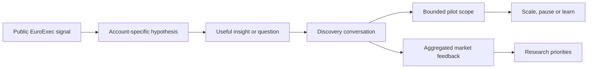

# Activation and 90-day forecasting layer

This module extends the partnerships operating system from prioritisation into commercial execution. It is a **proposed operating model**, not evidence of Sovrano's current pipeline, systems, conversion rates or internal decisions. No outreach or buyer validation has taken place.

## 1. Turning EuroExec into a useful first conversation

[EuroExec](https://sovrano.ai/euroexec/) is Sovrano's public, blind, expert-graded benchmark of frontier models on European executive reasoning. Its commercial value is not simply the leaderboard: it provides a substantive reason to approach teams responsible for model evaluation, European performance and domain-specific quality.

| Step | Commercial action | Evidence boundary | Exit criterion |
| --- | --- | --- | --- |
| Select | Choose one public EuroExec result, failure mode or European-context issue relevant to the target's visible work. | Relevance is not proof of an internal problem or buying intent. | A source-linked, one-sentence “why this account, why now” hypothesis. |
| Personalise | Connect the benchmark signal to the target's public model, product, geography or evaluation surface. | Keep company facts separate from the proposed interpretation. | The message would still be useful if the recipient never bought anything. |
| Open | Share a concise observation and ask a technically informed question—not a generic capability pitch. | Do not imply access to private results, datasets or roadmaps. | A reply, referral to the correct owner or explicit close. |
| Discover | Confirm task type, rubric, domain, language, volume, timeline, data constraints and decision process. | Record buyer-confirmed needs separately from author assumptions. | A qualified problem with owner, timing, scale and next step. |
| Scope | Translate the confirmed need into the smallest pilot that can test evaluator fit, rubric alignment and turnaround. | Delivery, security, privacy and rights remain subject to Sovrano approval. | Written scope, success criteria, dependencies and decision date. |
| Learn | Feed recurring, non-confidential market questions back to Research. | Never expose client-confidential information or present one comment as market consensus. | A prioritised research question supported by multiple recorded signals. |

Sovrano's public pilot guidance describes scoping the workflow, rubric, languages, volume and timeline before assembling and onboarding an evaluator team. This model uses that public path as the boundary between an interesting benchmark conversation and a deliverable pilot.

## 2. Stage-weighted 90-day pipeline and demand forecast

The forecast has two linked outputs:

1. **Commercial view:** which opportunities may reach a decision within 90 days.
2. **Workforce view:** what expert domains, languages and hours may be required, when and with what confidence.

### Illustrative stage model

The weights below are author-defined starting heuristics for model design. They are **not Sovrano conversion rates** and should be recalibrated against actual stage history.

| Stage | Required evidence | Illustrative planning weight |
| --- | --- | ---: |
| Mapped | Source-linked account hypothesis and named function. | 5% |
| Engaged | Relevant person has replied, referred or accepted a conversation. | 10% |
| Discovery | Meeting completed; problem, owner and timing partly understood. | 25% |
| Qualified | Need, scale, timing, decision process and credible delivery route confirmed. | 40% |
| Pilot scoped | Written pilot outcome, cohort, rubric, volume and dependencies defined. | 60% |
| Commercial review | Pricing, terms and internal approval route under discussion. | 75% |
| Procurement / security | Formal procurement, security or data-protection review active. | 85% |
| Committed | Signed agreement or equivalent written commitment. | 100% |

### Minimum opportunity record

| Field | Why it matters |
| --- | --- |
| Account, segment and opportunity owner | Shows concentration, accountability and coverage across labs, robotics and enterprise. |
| Public trigger and source date | Preserves the reason the account entered the map. |
| Buyer-confirmed need versus hypothesis | Prevents inference from becoming false pipeline. |
| Current stage, stage-entered date and next buyer action | Exposes stalled opportunities and forecast slippage. |
| Target pilot date and decision date | Places the opportunity inside or outside the 90-day window. |
| Low / base / high expert hours | Gives Workforce a range instead of false precision. |
| Domain, language, seniority and review depth | Converts commercial activity into a capacity requirement. |
| Procurement, security, privacy and delivery dependencies | Makes timing risk visible before a promise is made. |
| Confidence and evidence note | Records why the forecast should—or should not—be trusted. |

For opportunities with a scoped demand range:

`weighted expert hours = base expert hours × stage planning weight`

The forecast should also retain unweighted low and high scenarios. Mapped or merely engaged accounts should not create a staffing commitment; expert-hour estimates begin only when discovery provides a defensible task, domain, language and timing assumption.

### Operating cadence

| Cadence | Decision supported |
| --- | --- |
| Weekly pipeline review | Stage movement, next buyer action, stalled opportunities and CEO escalation. |
| Weekly capacity signal | Low/base/high expert hours by start week, domain and language. |
| Monthly calibration | Forecast versus actual movement, conversion and demand; adjust weights only from evidence. |
| Quarterly market review | Segment performance, EuroExec themes, lost reasons and research questions. |

### First 90 days

| Window | Proposed outcome |
| --- | --- |
| Days 1–30 | Confirm segment definitions, stage rules and data hygiene; build the first evidence-led account set; instrument outreach and discovery; establish a baseline forecast. |
| Days 31–60 | Run and compare account-specific EuroExec activation tests; complete discovery; scope the first credible pilots; begin forecast-versus-actual calibration. |
| Days 61–90 | Bring qualified opportunities to CEO review; issue the first workforce-linked demand range; document the repeatable motion and next-quarter priorities. |

## 3. Proposed commercial stack

Tool choice should follow the workflow and data requirements, not precede them. This is an illustrative shortlist based on tools the author can credibly discuss; it is not presented as Sovrano's current or preferred stack.

| Function | Proposed starting point | Selection test and guardrail |
| --- | --- | --- |
| CRM and forecast | **HubSpot** for a lean, fast-to-administer starting point; retain or use **Salesforce** if it is already the system of record or complexity requires it. | One accountable record per opportunity; mandatory next step, stage date, source and confidence; no parallel private spreadsheet pipeline. |
| Account research | Public company evidence and LinkedIn research, with a licensed enrichment provider selected only after a small EMEA accuracy and coverage test. | Check role accuracy, freshness, lawful basis, DPA, suppression handling, export/API access and cost before scale. |
| Outbound | CRM-native sequencing for email, supported by direct, referred, event and network routes. | Human approval before send; evidence-linked personalisation; opt-outs and suppression honoured; no autonomous mass outreach. |
| Meeting intelligence | Structured discovery template; **Fathom** or equivalent only where recording, consent and company policy permit. | Separate direct buyer statements from interpretation; store approved notes in the CRM. |
| Instrumentation | Native CRM reporting plus **Looker Studio** or an equivalent lightweight layer if cross-source analysis is needed. | Track response-to-meeting, meeting-to-qualified, stage age, forecast variance and capacity signals—not vanity activity alone. |
| AI-assisted workflow | Evidence capture, account briefs, message variants, call preparation and quality checks. | No unapproved confidential data; sources retained; human review required; AI never changes stage or sends externally without approval. |

## 4. From founder-led motion to team-run system

The operating system should reduce dependence on one person's memory and judgement. This is a proposed transfer model, not a recommendation about Sovrano's current structure or a fixed headcount plan.

| Phase | Head of Partnerships focus | What becomes reusable | Transfer test |
| --- | --- | --- | --- |
| Validate | Lead the first account hypotheses, outreach, discovery and pilot scopes; record why decisions were made. | Source rules, stage evidence, discovery fields, message tests and pilot boundaries. | A second operator can reproduce an account brief without relying on private explanation. |
| Codify | Turn recurring judgement into templates, examples, review questions and explicit escalation rules. | Segment playbooks, qualification guide, CRM definitions, forecast method and win/loss taxonomy. | Two people reviewing the same opportunity reach a materially consistent stage and confidence view. |
| Transfer | Give named account ownership to an operator while retaining call review, coaching and CEO escalation for material decisions. | Weekly pipeline and capacity cadence, call debriefs, stage audits and next-action discipline. | The operator can run the weekly review and surface exceptions without a shadow spreadsheet. |
| Scale | Hire against a demonstrated bottleneck—account coverage, market research or revenue operations—rather than an aspirational org chart. | Role scorecard, onboarding path, quality checks and 30/60/90-day outcomes. | New capacity improves qualified pipeline or forecast quality without weakening evidence standards. |

The first operators inherit the evidence ledger, account-brief template, outreach approval rules, discovery record, stage criteria, forecast fields, dashboard definitions and publication controls. The Head remains accountable for coaching, judgement quality, executive relationships and changes to the system.

## Decision rules

- Do not count a public signal as pipeline.
- Do not create workforce demand from an unqualified account.
- Do not advance a stage without the required evidence.
- Do not use a fixed probability as a substitute for judgement or historical calibration.
- Do not automate external communication before data, privacy, brand and approval controls are agreed.
- Do report forecast misses and lost reasons; they are inputs to better segmentation, research and proposition design.

## Public anchors

- [Sovrano Head of Partnerships role](https://app.sovrano.ai/careers/ea3a8346-691c-44e4-b4a6-edd01eef8aae): publicly names EuroExec activation, a 90-day demand forecast and ownership of the commercial stack.
- [EuroExec overview](https://sovrano.ai/euroexec/): supports the benchmark's public purpose, expert-authored tasks and blind expert grading.
- [How to start a pilot](https://sovrano.ai/support/ai-companies/ai-companies-onboarding/): supports the public scoping-to-pilot sequence and required workflow inputs.
- [Sovrano for AI companies](https://sovrano.ai/for-ai-companies/): supports the public proposition and evaluator workflow context.

These sources support the proposed operating model's public anchors. They do not validate the illustrative stage weights, imply current buyer demand or disclose Sovrano's internal systems.
